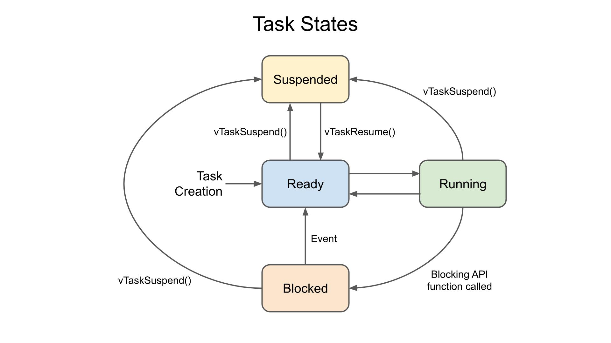
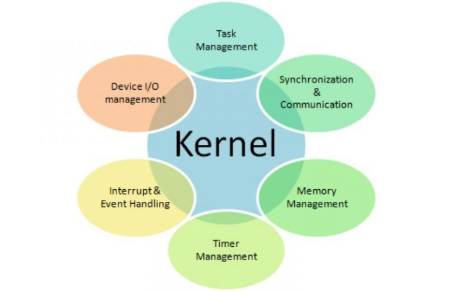
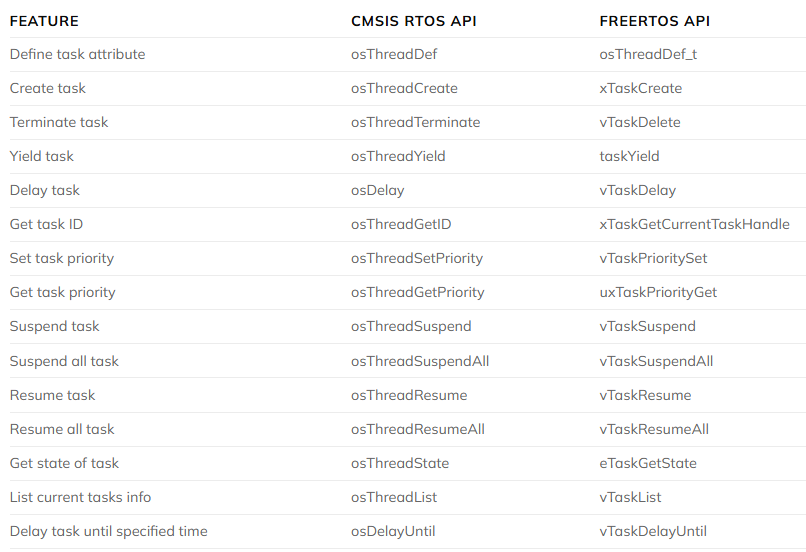
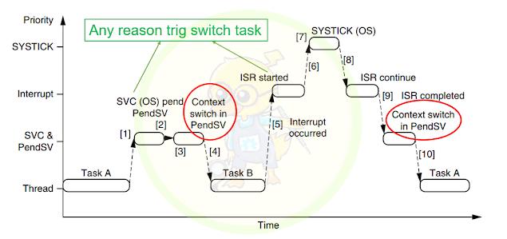
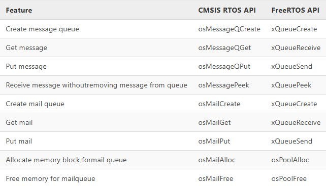
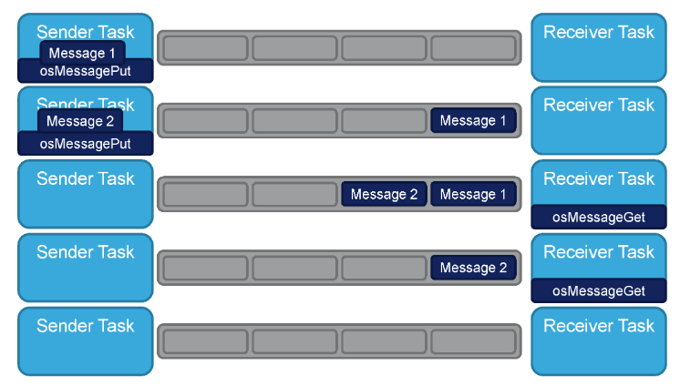
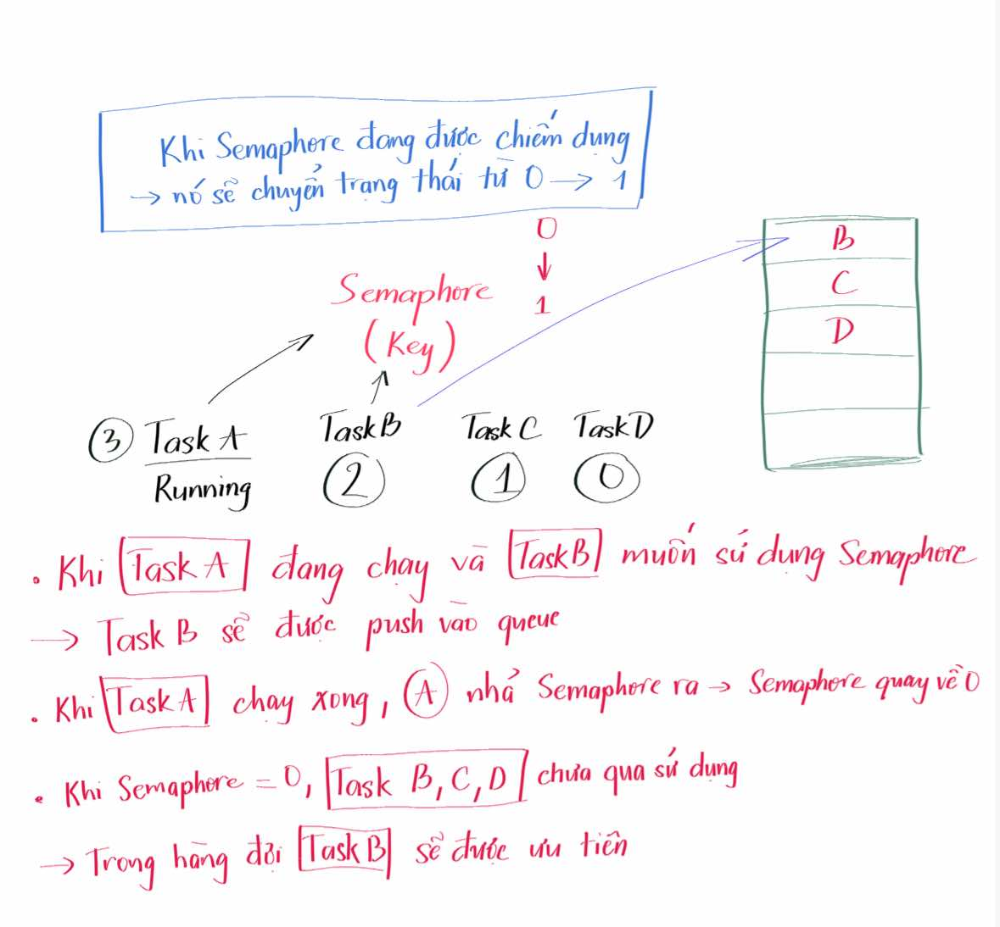
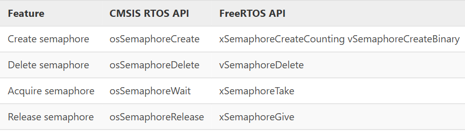
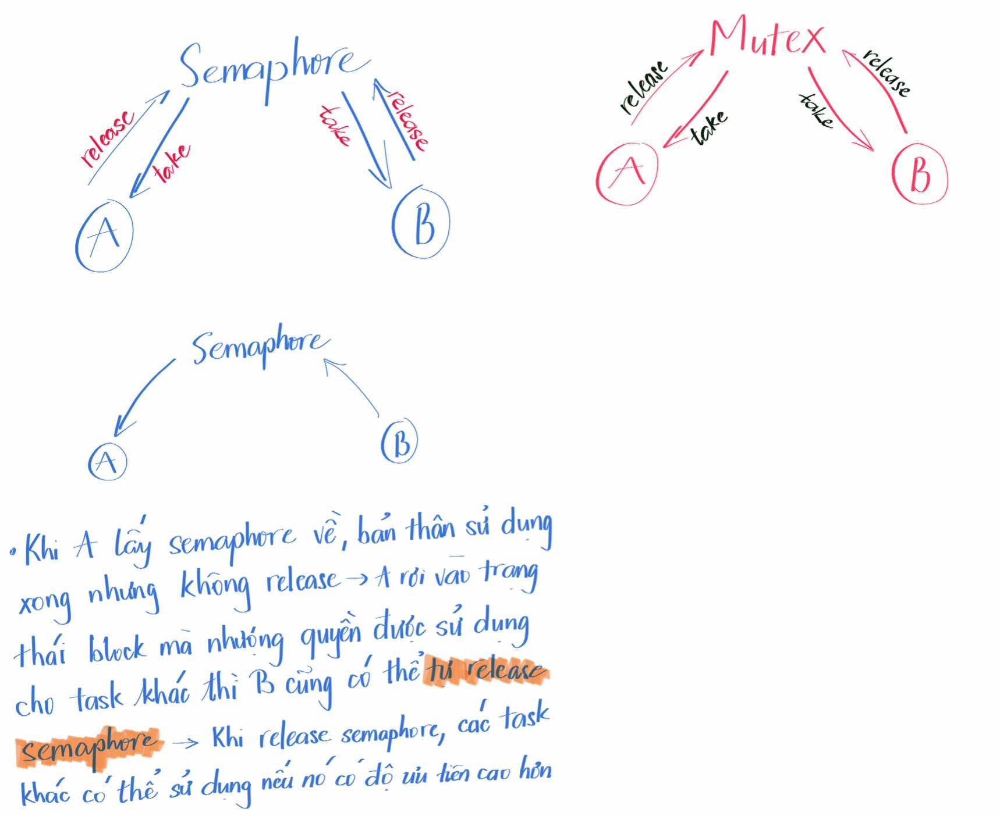

# Task trong RTOS 
* Một task là một đoạn chương trình (hàm) được thiết kế để chạy độc lập trong hệ thống
* Mỗi task có:
  * Stack riêng (dùng cho biến cục bộ, lưu context khi chuyển task)
  * Priority (độ ưu tiên): RTOS sẽ chọn task ưu tiên cao hơn để chạy trước
  * Trạng thái: Ready, Running, Blocked, Suspended...
* RTOS sẽ **quản lý và chuyển đổi** giữa các task (context switching) để tạo cảm giác như nhiều việc chạy song song (thực chất là đa nhiệm thời gian)

## Ví dụ thực tế
* Giả sử bạn có một hệ thống STM32 cần:
  * Task 1: Đọc cảm biến nhiệt độ mỗi 1 giây
  * Task 2: Điều khiển LED nhấp nháy mỗi 500 ms
  * Task 3: Gửi dữ liệu UART sang PC

## Ưu điểm của RTOS
* Tách biệt chức năng: mỗi công việc chạy độc lập, dễ bảo trì
* Đáp ứng real-time: nhờ ưu tiên, task quan trọng (ví dụ ngắt an toàn) sẽ luôn được xử lý trước
* Đa nhiệm: nhiều tác vụ "cùng chạy" trên một vi điều khiển

# Các trạng thái củ Task
* Running: đang được CPU thực thi
* Ready: sẵn sàng chạy, chờ CPU
* Blocked: đang chờ sự kiện (ví dụ chờ UART, chờ delay)
* Suspended: bị dừng bởi lập trình viên



# Quản lý task -> Kernel
* Kernel là lõi hệ điều hành, điều phối các tác vụ



# API


# Phân biệt các loại Delay
* **`HAL_DELAY`**: chạy vòng lặp `for` hoặc `while` trong n giây -> làm cho cả system delay trong n giây -> gây ra hiện tượng cả hệ thống delay chậm trễ  
* **`osDelay`**: delay tác vụ, chỉ có 1 task bị delay trong n giây -> nghĩa là task đó bị block trong n giây, còn các task khác vẫn running 

# Memory Management 


## Cấu trúc Memory của một Task trong RTOS
Một task trong RTOS có một số vùng bộ nhớ riêng:

**PC và SP là gì**
* **PC (Program Counter)**
  * Là thanh ghi của CPU lưu địa chỉ lệnh tiếp theo sẽ thực thi
  * Khi bạn chạy một task, PC sẽ trỏ đến hàm task function (ví dụ TaskFunc)

* **SP (Stack Pointer)**
  * Là thanh ghi của CPU trỏ tới đỉnh stack hiện tại
  * Mỗi task có stack riêng để lưu biến cục bộ, thanh ghi, địa chỉ trả về khi gọi hàm, ngữ cảnh CPU khi context switch

**(a) Task Control Block (TCB)**
* Là cấu trúc dữ liệu mà RTOS dùng để quản lý task
* Chứa thông tin như:
  * Con trỏ stack (SP ban đầu), PC của task (ví dụ: khi Task1 chạy, nó sẽ lấy PC và SP của task đưa vào thanh ghi PC và SP của cortex -> cho biết vùng stack của Task1 đang được khởi tạo -> dùng để thực thi các tác vụ của Task1)
  * Trạng thái task (Running, Ready, Blocked, Suspended)
  * Priority
  * ID hoặc tên task
  * Thời gian chờ (nếu delay)
* TCB thường được lưu trong heap hoặc static memory

**(b) Task Stack (Ngăn xếp riêng của task)**
* Mỗi task có stack riêng để lưu:
  * Biến cục bộ
  * Tham số hàm
  * Thanh ghi CPU khi context switch
* Khi context switch, RTOS sẽ:
    * Lưu trạng thái CPU của task A vào stack của task A
    * Phục hồi trạng thái CPU từ stack của task B

👉 Trong hệ thống có nhiều task → mỗi task có **1 TCB + 1 Stack riêng**

## Cách quản lý heap của RTOS
* **`heap_1`**: không cho phép giải phóng bộ nhớ
* **`heap_2`**: cho phép giải phóng bộ nhớ, nhưng không đặt các vùng Task cạnh nhau
* **`heap_3`**: dùng `malloc()` và `free()` chuẩn của C -> có thể giải phóng bộ nhớ. Nhưng chú ý ở đây là: vùng nhớ Task sau khi `free()` sẽ là vùng free space -> khi nó thành free space thì với các heap trên sẽ gây phân mảnh bộ nhớ -> khiến nó không còn được sử dụng một cách linh hoạt nữa
* **`heap_4`**: có thể giải phóng bộ nhớ và giải quyết phân mảnh bộ nhớ hiệu quả hơn
* **`heap_5`**: có thể giải phóng bộ nhớ và giải quyết phân mảnh bộ nhớ hiệu quả hơn

# Context Switching RTOS
* **Context switching** (chuyển đổi ngữ cảnh) là quá trình mà CPU chuyển từ thực thi tiến trình (process/thread/task) này sang tiến trình khác 
* **SysTick** là một bộ đếm thời gian như kiểm tra thời gian của các tác vụ đang chạy hoặc quyết định xem có cần phải thực hiện context switching hay không
* **PendSV** (Pending Supervisor Call) là một loại exception đặc biệt trên VĐK lõi ARM Cortex-M, được thiết kế để hỗ trợ quản lý ngữ cảnh (context switching) trọng HĐH thời gian thực (RTOS), giúp chuyển đổi giữa các task hiệu quả và đơn giản. Bản chất PendSV là ngắt phần mềm 
 

* **`vTaskSwitchContext`**: function tiến hành chuyển đổi ngữ cảnh 
* **`pxCurrentTCB`**: là một con trỏ toàn cục trong FreeRTOS, trỏ đến TCB của task hiện tại đang được thực thi 
## Ví dụ
Cho đoạn code sau của Task1:
```c
int a;
int b;
osDelay(5);
int c; // địa chỉ 0x0A (PC)
```
* Giả sử, có 2 task: Task1 (có độ ưu tiên cao hơn) và Task2 
* Khi chạy, PC của Cortex bằng `0x0A`. Nhưng trước khi thực hiện lệnh có địa chỉ `0x0A` phải thực hiện lệnh `osDelay`
* Khi đó, `0x0A` sẽ chuyển từ PC của Cortex sang PC của Task1 và lấy PC của Task2 đưa vào PC và SP của Cortex 
* Khi Task2 thực thi xong, nó sẽ chuyển đổi ngữ cảnh quay lại Task1. Khi đó, nó sẽ đưa giá trị `0x0A` vào PC Cortex -> PC sẽ biết được Task1 được thực hiện tiếp 

# Queue 
* **Message Queue** (hàng đợi thông điệp) là một cấu trúc dữ liệu FIFO trong RTOS, dùng để truyền dữ liệu giữa các task hoặc giữa ISR và task
* Có 2 loại:
  * **Message Queue**: truyền dữ liệu dạng đơn. Truyền theo quy tắc FIFO, chứa dữ liệu, kích thước và số ô dữ liệu được cố định khi tạo
  * **Mail Queue**: truyền dữ liệu dạng khối. Là 1 dạng của Queue, dữ liệu được gửi đi dưới dạng block, memory block cần được cấp phát và giải phóng

 

 ## Message Queue
  

## Mail Queue
* Hoạt động giống như **message queue**, nhưng có thêm khả năng quản lý bộ nhớ động để chứa dữ liệu (mail) có kích thước cố định
* Mỗi "mail" trong queue là một block dữ liệu có kích thước cố định do người dùng định nghĩa

### Đặc điểm 
* Kích thước của mỗi mail được định nghĩa trước (ví dụ 4 byte, 8 byte, hoặc một struct)
* RTOS sẽ tự động cấp phát & giải phóng vùng nhớ cho mỗi mail khi gửi/nhận
* Tránh việc user phải tự malloc/free hoặc copy dữ liệu
* Dùng khi muốn gửi struct hoặc dữ liệu lớn hơn con trỏ giữa các task

# Semaphore
## Semaphore là gì
* Bản chất là một hàng đợi nhưng không liên quan tới việc truyền dữ liệu 
* Các task có yêu cầu sử dụng tài nguyên sẽ được xếp vào hàng đợi
* Khi có **semaphore** được give thì task nào được xếp vào hàng đợi trước sẽ được sử dụng trước
* **Semaphore** là một cơ chế đồng bộ trong RTOS, dùng để quản lý truy cập tài nguyên dùng chung (ví dụ: UART, I2C, SPI, bộ nhớ, ngoại vi…) hoặc để đồng bộ hóa giữa các task/ISR và task
* Nó giống như một "cái đèn xanh/đỏ" cho phép hay không cho một task được quyền dùng tài nguyên

## Nguyên lý hoạt động 
* Để có thể sử dụng tài nguyên, task cần require chìa khóa để sử dụng
* Nếu chìa khóa đang không có task nào sử dụng thì có thể sử dụng tài nguyên 

  

## API
  

# Mutex
* Mutex = Mutual Exclusion (Loại trừ lẫn nhau)
* Đảm bảo rằng tại một thời điểm chỉ một task được quyền truy cập vào tài nguyên dùng chung
* Task nào “giữ” mutex thì các task khác muốn truy cập tài nguyên đó sẽ bị block (chờ) cho đến khi mutex được “nhả” (release)

## API
* `osMutexCreate()`
* `osMutexWait()`
* `osMutexRelease()`
* `osMutexDelete()`

## Khác biệt Binary Semaphore vs Mutex
  

# Event group
* Event Group (nhóm sự kiện) là một tập hợp các bit (thường 24 bit) mà các task có thể chờ (wait) hoặc đặt (set/clear)
* Mỗi bit trong event group đại diện cho một sự kiện nào đó
* Nó cho phép đồng bộ nhiều task với nhau dễ dàng hơn semaphore hay mutex
* 1 event group gồm nhiều event flag, có tối đa 24 flag trong 1 event group (0-23)
